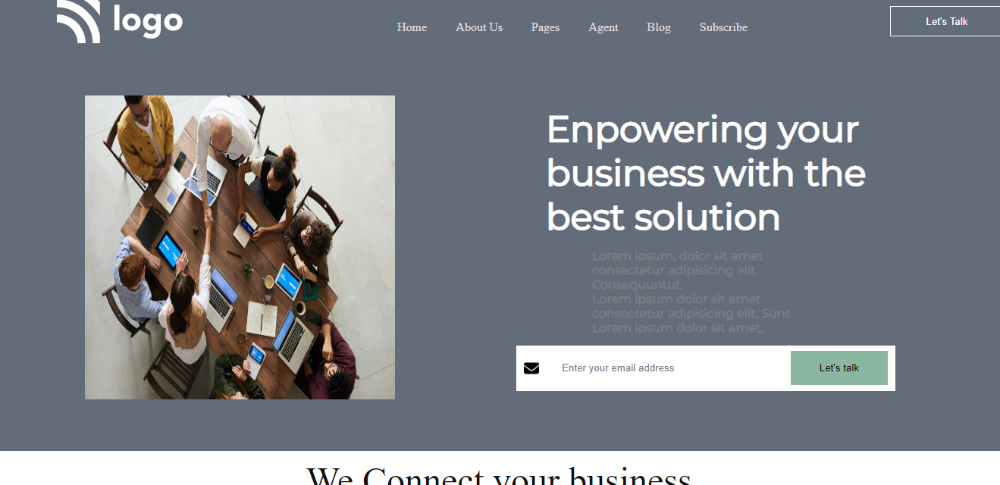

## 🔗Project 12 Link
https://project-12-live-link.netlify.app/
 

# ✨ Project 12 : Business Landing Page ✨

This assignment is written in **HTML5 and CSS3** which is given in **"JavaScript Full Stack Web Developer Bootcamp"** by **iNeuron**.

 

 

 

## 📌 Screenshot

 

 

## 📌 What I Learn

    👉 Structuring HTML and CSS.
    👉 Positions in CSS.
    👉 Various CSS Selectors  etc.
    👉 RGBA colors.
    👉 Flexbox in CSS.
    👉 Gradient colors in CSS.
    👉 How to use SVG images.

## I took 7 hours to build this project and 4-hours to make it responsive I really enjoyed it 😊.

## 💬 Connect With Me

- **Email** - sainianjali1097@gmail.com

## 📌 Acknowledgments

- Course Instructor - [Hitesh Choudhary](https://github.com/hiteshchoudhary)
